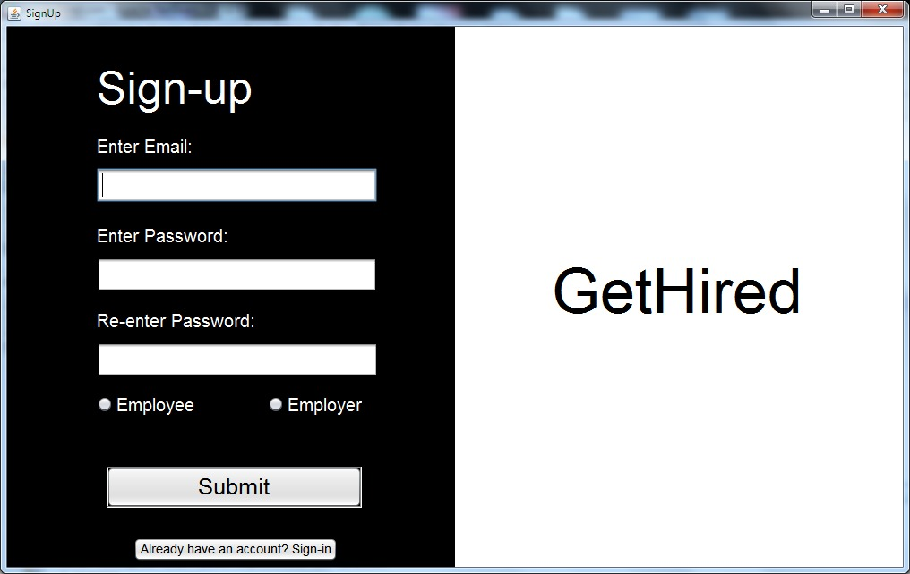
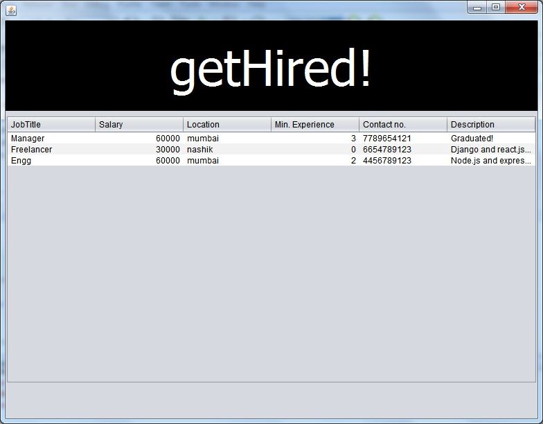
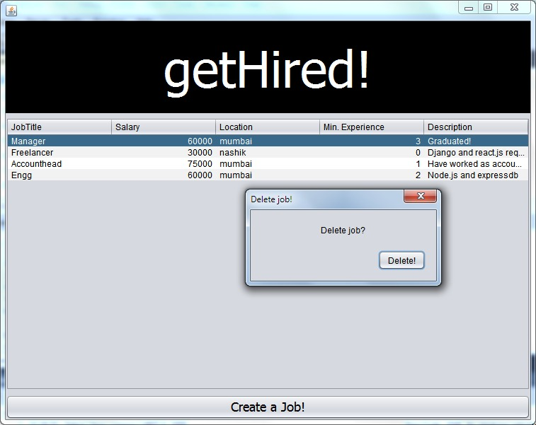
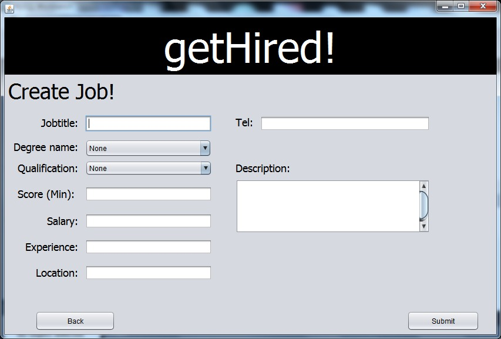

# getHired!
**This is a repository of GUI based _"Employement Management System"_ built for _Employer_ and _Employee_**

<h3>This project is completely built using:</h3>

>Java

***Features for Employee base:***
- Registration
- Watch through all details of jobs that is relevant and matches his career/profession

***Features for Employer base:***
- Registration
- Watch through all jobs put through portal
- Create jobs by filling forms
- Delete jobs posted earlier

<h3>Sign Up Page</h3>

<h3>Index For Employee</h3>

<h3>Index for Employer</h3>

<h3>Job creation form</h3>

